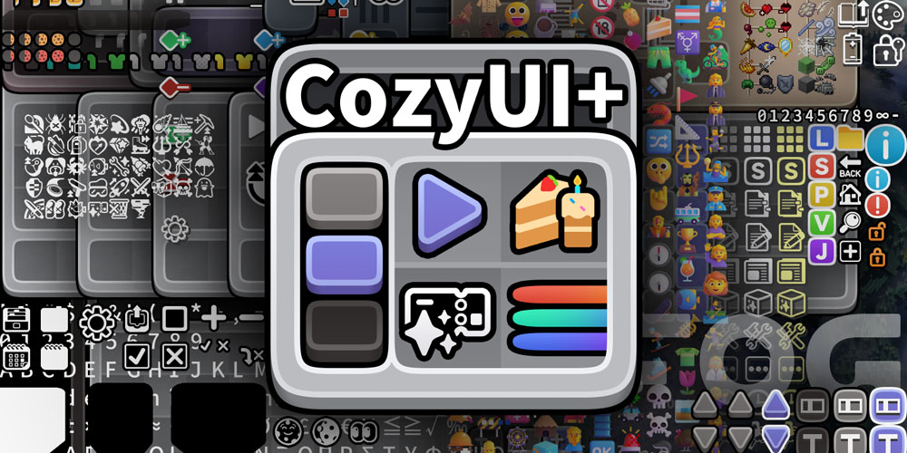

<h1 align="center">CozyUI+</h1>

Give Minecraft a cozy look!

 

## Texture Info ● 简介

This texture pack brings a neat and high-resolution visual, covering all the vanilla UI elements and many popular mods.

这款材质包带来简洁细腻，高清风格的用户界面，兼容所有原生UI和众多常见的模组。

Minecraft version: >1.20

>This repo is Kelvin_LBY's continuation of Fogg05's CozyUI+, kept alive to ensure future compatibility updates. Fogg05 was a talented creator who built something truly special — this fork exists to honor that work and keep it in the hands of the community who loved it. 💙 In memory of Fogg05. 
> 这个仓库是 Kelvin_LBY 的分支，旨在为 CozyUI+ 提供持续的新版本兼容更新。零雾〇五是一位才华横溢的创作者，留下了这份珍贵的作品——这个分支的存在，是为了延续他的心血，让热爱它的人们能够继续使用。💙 谨以此纪念零雾〇五。
>
> I'm primarily a mod developer, so texture pack work is a bit outside my comfort zone — which means your contributions matter more than ever! Whether you're fixing a misaligned pixel, adding a new mod compatibility, or just catching a bug, every pull request is genuinely appreciated. No contribution is too small. 🙌 
> 我主要做的是模组开发，材质包并不是我最擅长的领域——这也意味着你的贡献比以往任何时候都更加重要！ 无论是修复错位的像素、添加新的模组适配，还是发现一个小 bug，每一个 PR 都会被认真对待。没有任何贡献是微不足道的。🙌
>
> If you'd like to help maintain Fogg05's vision, feel free to open an issue, submit a PR, or just say hi in the discussions. This project belongs to the everyone of us. ❤️ 
> 如果你愿意帮助延续零雾〇五的创作理念，欢迎提 issue、发起 PR，或者在讨论区打个招呼。这个项目属于我们每一个人。❤️

***

#### 如果喜欢 🥰 我的作品，🙏 请务必在网页右上角 ↗️ 给这个项目点颗星星 ⭐Star 感谢您的支持！！！🤩🤩🤩

作者Ｂ站：https://space.bilibili.com/350715147

作者网名：零雾〇五Fogg05

***

## License ● 许可证

This project is open sourced under GPL-v3.0 license, feel free to contribute!

材质包现在以 GPL 3.0协议开源，欢迎大家参与创作~

   
This pack is based on - 作品基于：

- Fluent Emoji：https://github.com/microsoft/fluentui-emoji

- NotoSans：https://github.com/notofonts/noto-cjk

 

## Compatible mods ● 适配MOD列表

| Mod Name 模组名称 | Link 链接 | - |
|:------:|:------:|:------:|
OptiGUI | [🔗 Modrinth](https://modrinth.com/mod/optigui) | ⭐ Recommended
Apple Skin - 苹果皮 | [🔗 Modrinth](https://modrinth.com/mod/appleskin) | 🔄 Optional
Detail Armor Bar - 细节盔甲 | [🔗 Modrinth](https://modrinth.com/mod/detail-armor-bar) | 🔄 Optional
Litematica - 投影 | [🔗 Modrinth](https://modrinth.com/mod/litematica) | 🔄 Optional
MiniHUD - 迷你HUD | [🔗 Modrinth](https://modrinth.com/mod/minihud) | 🔄 Optional
Replay Mod - 录像回放 | [🔗 Modrinth](https://modrinth.com/mod/replaymod) | 🔄 Optional
Inventory Hud+ - 物品栏HUD+ | [🔗 CurseForge](https://www.curseforge.com/minecraft/mc-mods/inventory-hud-forge) | 🔄 Optional
Dynamic Crosshair - 动态准星 | [🔗 Modrinth](https://modrinth.com/mod/dynamiccrosshair) | 🔄 Optional
Jade - 玉 | [🔗 Modrinth](https://modrinth.com/mod/jade) | 🔄 Optional
Roughly Enough Items - REI物品管理器 | [🔗 Modrinth](https://modrinth.com/mod/rei) | 🔄 Optional
Just Enough Items - JEI物品管理器 | [🔗 Modrinth](https://modrinth.com/mod/jei) | 🔄 Optional
Inventory Profiles Next - 一键背包整理Next | [🔗 Modrinth](https://modrinth.com/mod/inventory-profiles-next) | 🔄 Optional
Xaero's Minimap - Xaero的小地图 | [🔗 Modrinth](https://modrinth.com/mod/xaeros-minimap) | 🔄 Optional
Xaero's World MAP - Xaero的世界地图 | [🔗 Modrinth](https://modrinth.com/mod/xaeros-world-map) | 🔄 Optional
Mod Menu - 模组菜单 | [🔗 Modrinth](https://modrinth.com/mod/modmenu) | 🔄 Optional
No Chat Reports - 禁用聊天举报 | [🔗 Modrinth](https://modrinth.com/mod/no-chat-reports) | 🔄 Optional
Simple Voice Chat - 简单的语音聊天 | [🔗 Modrinth](https://modrinth.com/plugin/simple-voice-chat) | 🔄 Optional
Entity Features - 实体特性 | [🔗 Modrinth](https://modrinth.com/mod/entitytexturefeatures) | 🔄 Optional
Overflowing Bars | [🔗 Modrinth](https://modrinth.com/mod/overflowing-bars) | 🔄 Optional

 

## Custom Adjustments ● 新增特性

#### Recipes in the brewing stand - 酿造台配方

All the recipes are drawn on the brewing stand interface to help everyone memorize.

在酿造台界面上绘制了所有的配方，帮助大家记忆。

#### Small icon in front of enchantment names - 附魔小图标

In the item description of the Enchanted Book, a small icon has been added in front of enchantment names.

在附魔书的物品介绍中，给附魔属性添加了小图标。

#### OptiGUI MOD

Various colored shulker boxes, droppers, dispensers, and ender chests can be distinguished by the background color.

各种颜色的潜影盒、投掷器和发射器、末影箱的界面可以通过背景颜色区分。

#### Emoji+ & MCsans+

Modify the fonts to high-definition NotoSans and FluentEmoji.

内置了这两款材质包。Emoji+ 将 Emoji 修改为了 FluentEmoji，MCsans+ 将字体修改为了高清的 NotoSans。

https://github.com/Fogg05/Emoji-Plus

https://github.com/Fogg05/MCsans-Plus

#### Experience bar RGB - 经验条RGB

Inventory selection boxes and experience bars feature RGB cycling with a very slow gradient, where the colors are continually adjusted to ensure a leisurely and soothing pace.

物品栏选中框、经验条会 RGB 循环渐变，渐变速度非常慢，颜色经过反复调整，确保节奏悠闲舒缓。

#### Button Animations - UI控件动画

Some buttons will be animated in game versions ≥1.21

为部分界面元素添加了动画，需要 ≥1.21

